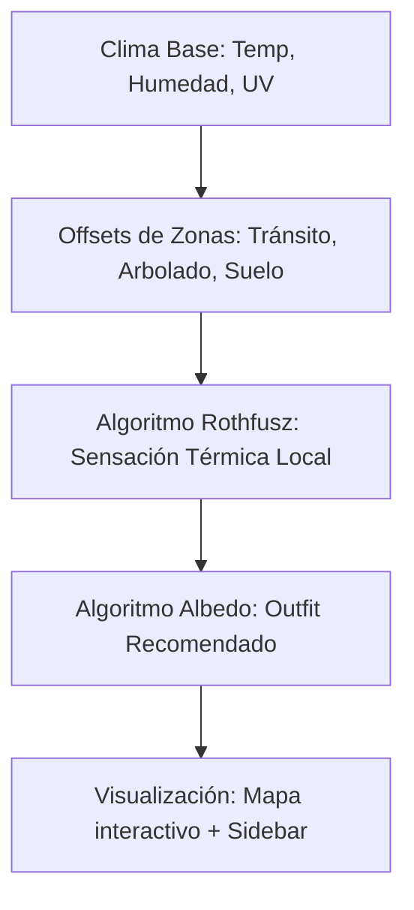

# Brief de Presentación: Climate Monte Castro

Este documento contiene un desglose estructurado y ultra-detallado sobre el funcionamiento, arquitectura y propósito del sistema **Climate Monte Castro**. Está optimizado para ser utilizado como prompt o base de datos por un modelo de lenguaje (como GPT-4, Claude, Gamma, SlidesGPT, etc.) con el fin de redactar o estructurar una presentación académica, técnica o comercial sobre el proyecto.

---

## Estructura Sugerida para las Diapositivas

### Diapositiva 1: Portada e Introducción
*   **Título de la presentación:** Climate Monte Castro
*   **Subtítulo:** Monitoreo Climático y Albedo Urbano en el Confort Peatonal
*   **Propósito:** Modelado de microclimas urbanos e islas de calor en Monte Castro, CABA, combinando simulación física, geolocalización y recomendaciones de mitigación individuales.

---

### Diapositiva 2: Planteamiento del Problema (El Contexto)
*   **El Desafío:** Las **Islas de Calor Urbanas (ICU)**. La urbanización reemplaza la vegetación natural por superficies absorbentes (asfalto, hormigón), elevando de forma crítica la temperatura local.
*   **El Foco Peatonal:** Los peatones sufren de forma desigual las condiciones térmicas según la calle por la que transitan (corredores comerciales con pavimento oscuro vs. plazas verdes).
*   **Caso de Estudio:** Manzanas reales del Barrio de Monte Castro, CABA, caracterizadas por su diversidad de densidad edilicia, tránsito vehicular y arbolado público.

---

### Diapositiva 3: ¿Qué es Climate Monte Castro? (La Solución)
*   **Definición:** Es una aplicación web interactiva (PWA) de monitoreo y simulación climática a escala micro-local (manzanas y zonas específicas).
*   **Tres pilares clave:**
    1.  **Telemetría y Simulación Georreferenciada:** División del barrio en 9 zonas con microclimas simulados matemáticamente a partir de condiciones meteorológicas de base.
    2.  **Modelado Térmico Físico:** Cálculo preciso de la Sensación Térmica (Heat Index) mediante algoritmos reconocidos internacionalmente.
    3.  **Mitigación Activa por Albedo:** Recomendaciones personalizadas de vestimenta basadas en las propiedades reflexivas del espectro cromático (albedo) y características de telas.

---

### Diapositiva 4: Arquitectura del Sistema (Stack Tecnológico)
*   **Arquitectura:** Cliente-Servidor desacoplada, preparada para despliegue serverless (ej. Vercel).
*   **Backend (Servidor API):**
    *   **Node.js + Express:** API REST que expone datos en tiempo real (`/api/telemetria`) y el registro de tendencias (`/api/historico`).
    *   **Motor de Simulación Integrado:** Lógica matemática de offsets que añade variaciones térmicas dinámicas según variables geográficas de las zonas.
*   **Frontend (Aplicación Cliente):**
    *   **React + Vite:** Renderizado ultrarrápido y reactivo.
    *   **Leaflet (Mapas Interactivos):** Motor GIS ligero sin dependencias pesadas para interactuar directamente con polígonos urbanos sobre mapas en modo oscuro.
    *   **Framer Motion:** Animaciones suaves para transiciones de los paneles de detalle y entrada de datos.

---

### Diapositiva 5: El Cerebro Matemático (Algoritmo de Sensación Térmica)
*   **Modelo Utilizado:** Fórmula del **Heat Index (Índice de Calor) de Rothfusz**, empleada por la Oficina Meteorológica de EE.UU. (NOAA).
*   **Funcionamiento:** Combina la temperatura del aire ($T$ en Fahrenheit) y la humedad relativa ($RH$ en %) aplicando regresiones múltiples no lineales para estimar el estrés por calor humano.
*   **Fórmula Base:**
    $$HI = -42.379 + 2.049T + 10.14RH - 0.22T \cdot RH - 0.0068T^2 - 0.054RH^2 + 0.0012T^2 \cdot RH + 0.00085T \cdot RH^2 - 0.00000199T^2 \cdot RH^2$$
*   **Ajustes Críticos:** El sistema incluye dinámicamente factores de corrección para humedades relativas extremas (menor a 13% o mayor a 85% en rangos de temperatura específicos).

---

### Diapositiva 6: Factores Microclimáticos Urbanos (Las 9 Zonas de Simulación)
El sistema evalúa e introduce offsets a partir del perfil físico de cada manzana de Monte Castro:
1.  **Arbolado Público (Sombra y Oasis Térmico):** Zonas con arbolado "Excelente" reciben hasta -3.1°C de reducción de temperatura.
2.  **Tránsito Vehicular (Calor Antrópico):** Flujos de tránsito "Pesado" o "Moderado" elevan localmente la temperatura.
3.  **Tipo de Superficie (Coeficiente de Absorción):** Compara asfalto (alta absorción calórica / bajo albedo), pavimento y tierra/pasto (bajo almacenamiento de calor).

#### Las Zonas Representativas:
*   *Plaza Don Pedro de Mendoza (Centro - Oasis Verde):* Temperatura reducida gracias al pasto e inmenso arbolado (Offset: -3.1°C).
*   *Av. Álvarez Jonte y Segurola (Suroeste - Corredor Comercial):* Alto tránsito vehicular, asfalto puro y arbolado bajo (Offset: +1.8°C).

---

### Diapositiva 7: Recomendaciones de Albedo y Vestimenta
*   **¿Qué es el Albedo?** Es el porcentaje de radiación que una superficie refleja respecto a la que incide sobre ella. El blanco tiene un albedo cercano a 1 (refleja el 100% de la luz solar), el negro tiene albedo cercano a 0 (absorbe casi toda la energía térmica).
*   **Funcionamiento de la Lógica de Outfit:**
    *   **Calor Extremo (Sensación $\ge$ 33°C):** Alerta Roja. Recomienda colores reflectivos (Blanco, Beige, Pasteles), prohíbe colores absorbentes (Negro, Azul marino, Bordó) y sugiere tejidos de trama abierta como Lino 100% o Algodón liviano.
    *   **Calor Moderado (Sensación $\ge$ 28°C):** Alerta Naranja. Sugiere remeras sueltas, colores claros y rutas peatonales con sombra.
    *   **Zona Verde (Sensación < 28°C):** Rango de confort. Permite colores libres e incentiva actividades al aire libre.

---

### Diapositiva 8: Experiencia del Usuario (UX/UI en Acción)
*   **Visualización en Mapa Oscuro:** Polígonos de zonas coloreadas dinámicamente según la severidad del microclima local (Verde = Confortable, Amarillo = Moderado, Rojo = Crítico / Isla de Calor).
*   **Detalle Flotante Dinámico:** Al presionar sobre una manzana del mapa, un panel lateral dinámico emerge deslizando la información climática (Temp, Humedad, UV, sensaciones térmicas), características físicas del terreno y el *outfit sugerido* en base al albedo.
*   **Tendencia Histórica:** Gráficos sparkline que muestran la evolución térmica de las últimas horas para evaluar si la isla de calor está en proceso de acumulación o disipación.

---

### Diapositiva 9: Impacto del Proyecto y Conclusiones
*   **Planificación Urbana Inteligente:** Demuestra cuantitativamente el impacto de incorporar plazas de tierra y arbolado en lugar de pavimentar indiscriminadamente.
*   **Mitigación Activa:** Empodera al ciudadano con información útil para su día a día (saber qué vestir según su destino y qué avenidas evitar en horas pico de calor).
*   **Proyección:** Integración con sensores IoT reales instalados en las esquinas de Monte Castro para reemplazar la simulación física por telemetría física en tiempo real.
